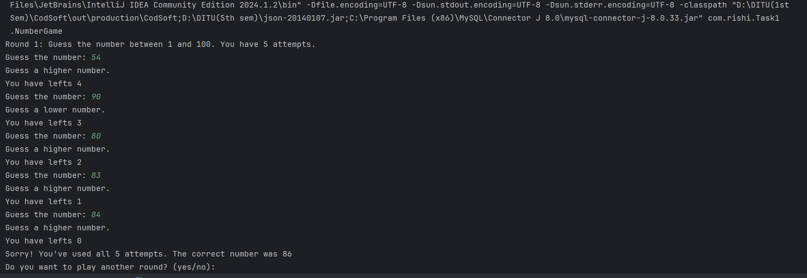
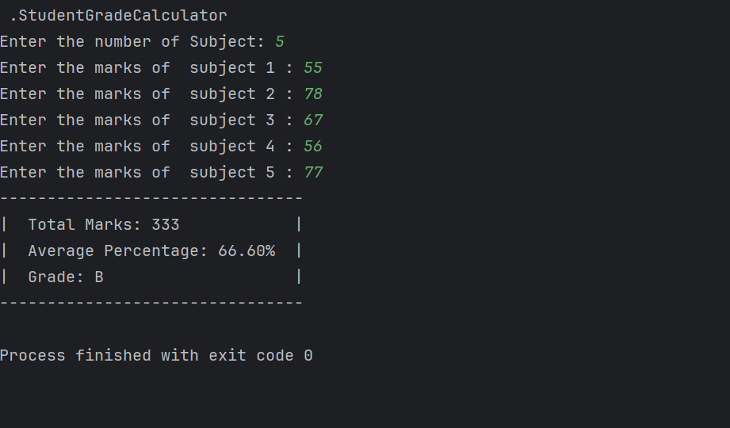
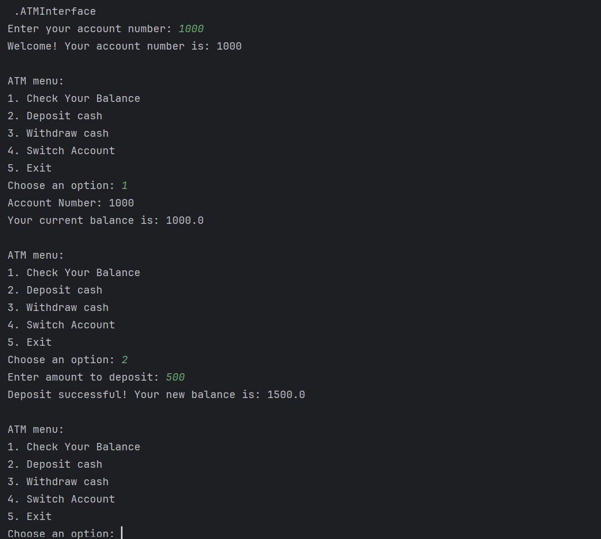
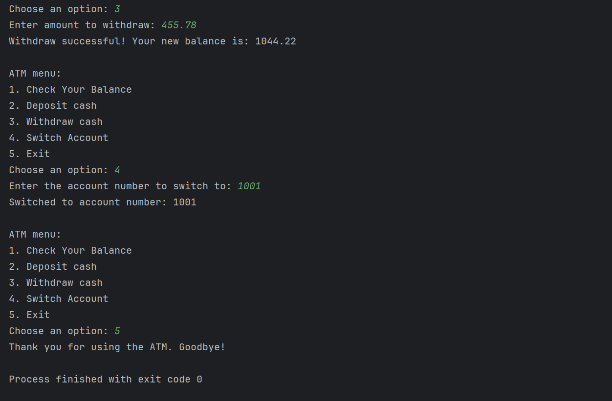
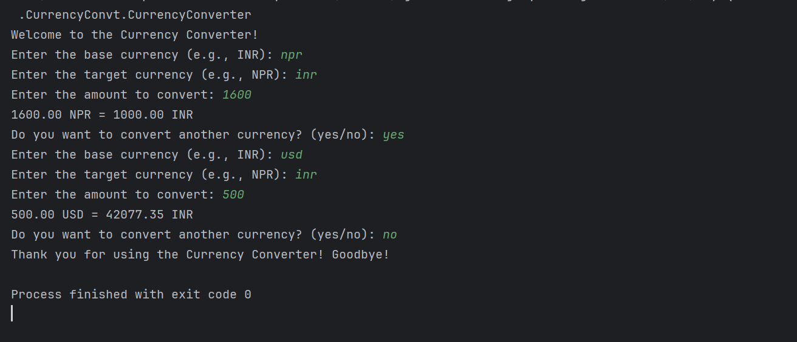
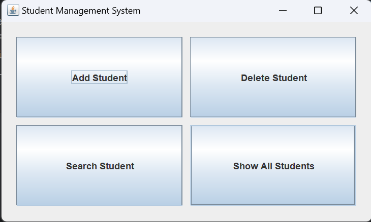
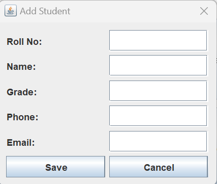
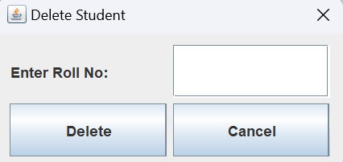
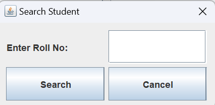
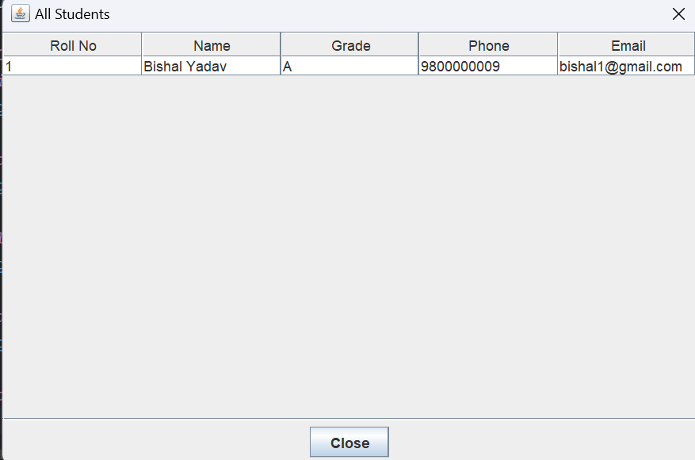

# CodSoft Internship - Java Projects
# Author : Rishi Yadav
# BTech CSE 3rd - year student

This repository contains five tasks completed as part of my internship at CodSoft. Each task is designed to enhance my Java programming skills and understanding of software development principles. Below are descriptions, highlighted features, and output placeholders for each task.

---

## Task 1: Number Guessing Game

### Description
The Number Guessing Game is a simple console-based application where the player tries to guess a randomly generated number within a specific range. It aims to test and improve logical thinking by providing feedback after each guess. The game ends when the player correctly guesses the number.

### Features
- **Random Number Generation**: Generates a random number between 1 and 100 for the player to guess.
- **User Input**: Accepts guesses from the player through the console.
- **Feedback Mechanism**: Informs the player if the guess is too high or too low, helping narrow down the answer.
- **Attempt Tracking**: Keeps count of the attempts the player takes to guess the correct number.
- **Replay Option**: Allows the player to start a new game after guessing the correct number.

### Output

---

## Task 2: Student Grade Calculator

### Description
The Student Grade Calculator is a Java application that accepts a student's scores and calculates their final grade based on predefined criteria. This task emphasizes input validation, calculations, and output display, providing practical experience in handling user inputs and displaying calculated results.

### Features
- **Subject Score Input**: Accepts scores for multiple subjects from the user.
- **Automated Grade Calculation**: Computes the final grade based on the entered scores.
- **Performance Feedback**: Displays grades alongside a Pass/Fail indication based on student performance.
- **Data Validation**: Ensures that scores are valid (e.g., within acceptable ranges) before proceeding with calculations.

### Output

---

## Task 3: ATM Interface

### Description
The ATM Interface simulates a basic banking application, allowing users to perform typical banking operations like checking balances, withdrawing, and depositing money. This task provided insight into user authentication, input handling, and the implementation of basic banking functions.

### Features
- **User Login System**: Simulates user authentication using unique account numbers for each session.
- **Balance Inquiry**: Displays the current account balance for the user.
- **Cash Withdrawals**: Allows users to withdraw a specified amount, ensuring withdrawal limits and sufficient balance.
- **Deposits**: Enables users to deposit money into their account.

### Output

---

## Task 4: Currency Converter

### Description
The Currency Converter application provides a user-friendly interface for converting an amount from one currency to another based on real-time exchange rates. This task involved working with APIs, handling user input, and displaying conversion results.

### Features
- **Currency Selection**: Allows users to choose the base and target currencies from dropdown lists.
- **Real-Time Exchange Rates**: Retrieves live exchange rates to perform accurate currency conversions.
- **Amount Input**: Lets users input the amount they wish to convert.
- **Conversion Display**: Shows the converted amount after completing the calculation.
- **Error Handling**: Displays error messages for invalid inputs or network issues.

### Output

---

## Task 5: Student Management System

### Description
The Student Management System is a GUI-based application that helps manage student data, including adding, updating, searching, and deleting student records. It connects to a MySQL database, providing real-world experience in database integration and Java Swing GUI design.

### Features
- **Student Record Management**: Allows adding, updating, and deleting student information.
- **Database Connectivity**: Integrates with MySQL to store and retrieve student data.
- **Search Functionality**: Enables searching for student records by roll number.
- **User-Friendly GUI**: Built using Java Swing for an intuitive and accessible interface.
- **Data Validation**: Ensures all inputs meet required criteria before database entry.

### Output
# MainWindow

# Add Student Window

# Delete Student Window

# Search Student Window

# Show All Students Window

---

## Conclusion
These tasks have been instrumental in developing a strong foundation in Java programming, user interface design, and practical software development concepts. I look forward to applying these skills in more complex projects and further advancing my expertise.

---

## Acknowledgments
Special thanks to CodSoft for this internship opportunity and for providing me with meaningful projects that allowed me to deepen my understanding of Java and software development practices.

---

